# My-MLOps-Notes
Listing my MLOps learnings

This repository is containing my notes from [this Udemy course](https://www.udemy.com/course/complete-mlops-bootcamp-from-zero-to-hero-in-python-2022/).

1) 85 percent of trained ML model don't reach production and 55 % of companies don't deploy a single model.

2) An ideal ML life cycle

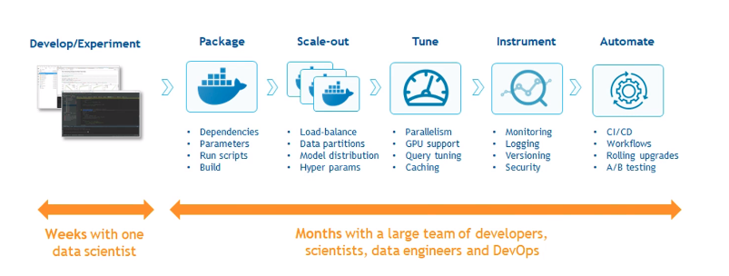

3) Researches show that companies using UI increased their profit margin by 3% to 15%.

4) DevOps applied to Machine Learning is known as MLOps. Model creation must be scalable, collaborative and reproducible. The principles, tools and techniques that make models scalable, collaborative and reproducible are known as MLOps.

5) MLOps process:

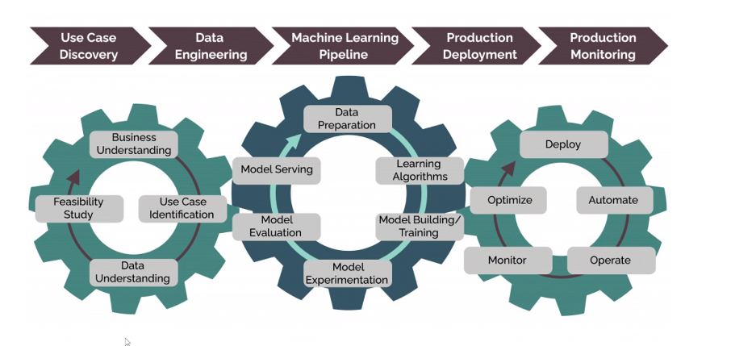

6) DevOps applied to Machine Learning is known as MLOps. DevOps applied to Data is known as DataOps.

7) Roles in MLOps

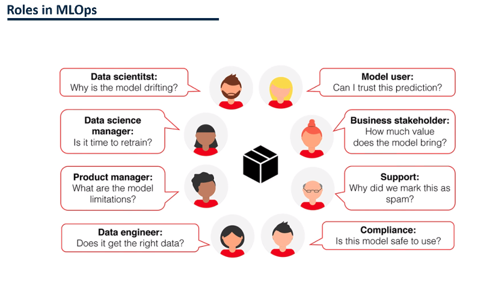

8) Challenges addressed by MLOps

- Data and Artifact versioning

- Model Tracking: Degradition of performance due to data drift.

- Feature Generation: MLOPS allows to reuse methods

9) Parts of MLOPS

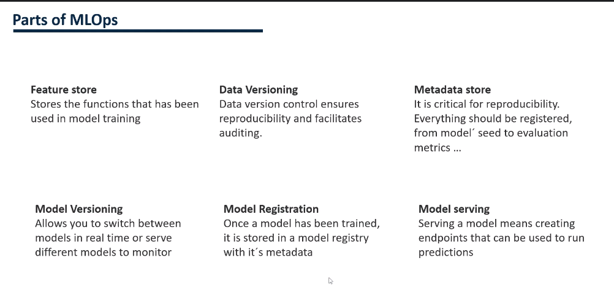

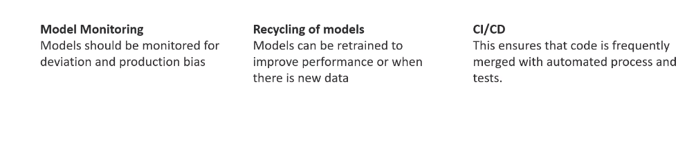

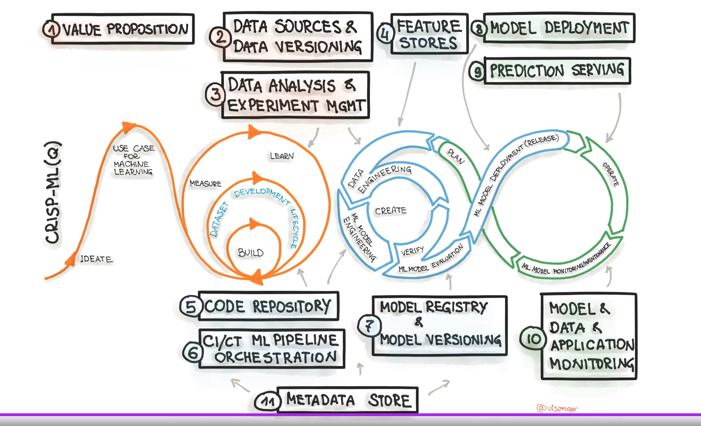

10) MLOps Tools

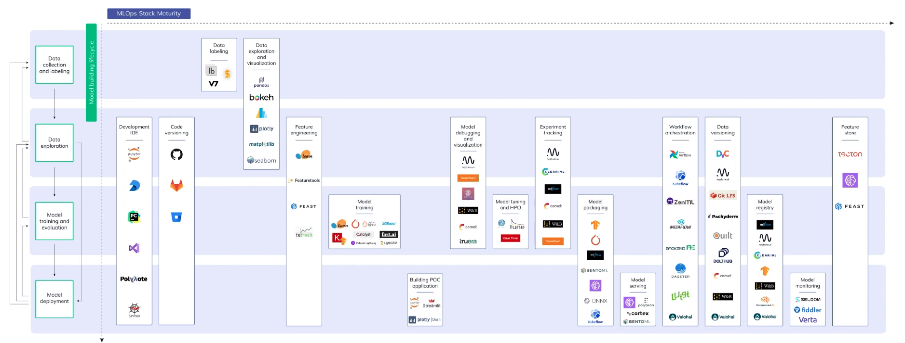

11) Some data labelling tools:

- [v7labs](https://www.v7labs.com/pricing)

- [labelbox](https://labelbox.com/pricing/)

12) Some Feature Engineering Tools:

- [feast](https://github.com/feast-dev/feast)

- [featuretools](https://github.com/alteryx/featuretools)

- [tsfresh](https://github.com/blue-yonder/tsfresh)

13) Some Hyperparameter Optimization Tools:

- [Optuna](https://optuna.org/)

- [Ray Tune](https://docs.ray.io/en/latest/tune/index.html)

14) Fast API can be used in serving ML model.

15) Streamlit is useful for POC.

16) MLOps stages:

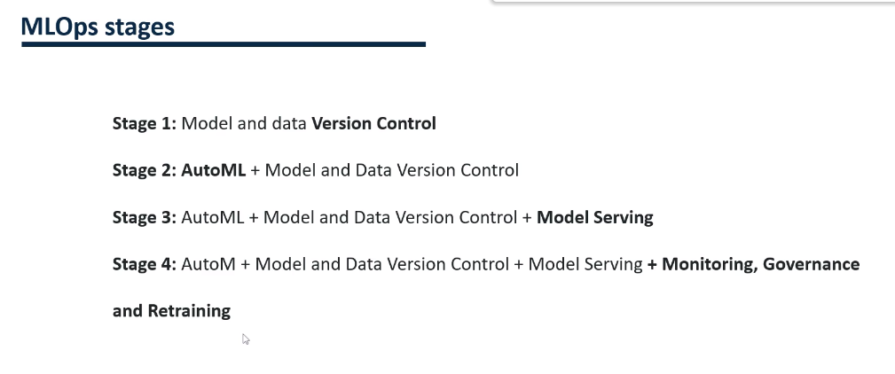

17) Some tools to use

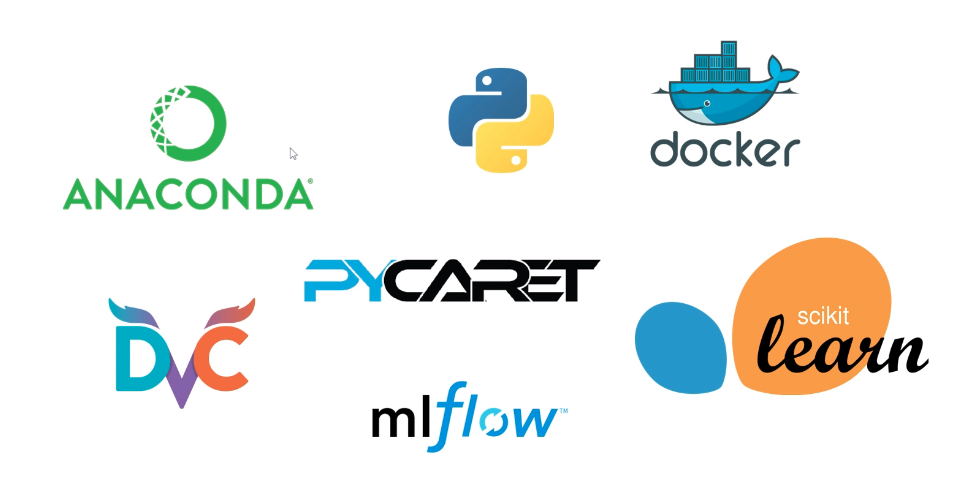

18) Structuring ML projects in one of 3 ways.

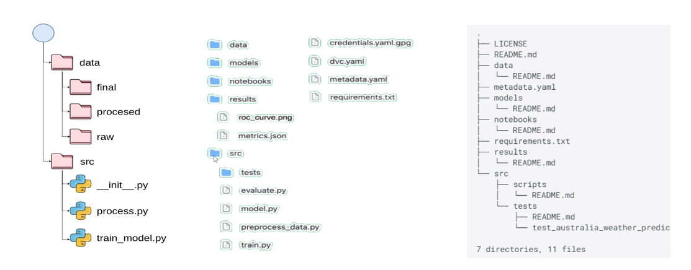

19) Cookiecutter is a tool to structure our ML projects and folders.

```runall.sh
pip install cookiecutter

cookiecutter https://github.com/khuyentran1401/data-science-template
```

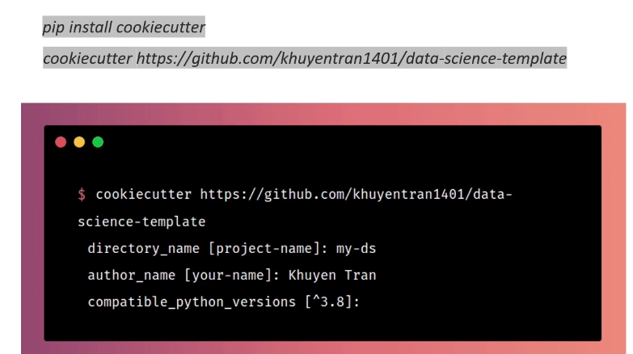


