# My-MLOps-Notes
Listing my MLOps learnings

This repository is containing my notes from [this Udemy course](https://www.udemy.com/course/complete-mlops-bootcamp-from-zero-to-hero-in-python-2022/).

1) 85 percent of trained ML model don't reach production and 55 % of companies don't deploy a single model.

2) An ideal ML life cycle


3) Researches show that companies using UI increased their profit margin by 3% to 15%.

4) DevOps applied to Machine Learning is known as MLOps. Model creation must be scalable, collaborative and reproducible. The principles, tools and techniques that make models scalable, collaborative and reproducible are known as MLOps.

5) MLOps process:


6) DevOps applied to Machine Learning is known as MLOps. DevOps applied to Data is known as DataOps.

7) Roles in MLOps


8) Challenges addressed by MLOps

- Data and Artifact versioning

- Model Tracking: Degradition of performance due to data drift.

- Feature Generation: MLOPS allows to reuse methods

9) Parts of MLOPS


10) MLOps Tools


11) Some data labelling tools:

- [v7labs](https://www.v7labs.com/pricing)

- [labelbox](https://labelbox.com/pricing/)

## Feature Engineering

12) Some Feature Engineering Tools:

- [feast](https://github.com/feast-dev/feast)

- [featuretools](https://github.com/alteryx/featuretools)

- [tsfresh](https://github.com/blue-yonder/tsfresh)

## Hyperparameter Optimization

13) Some Hyperparameter Optimization Tools:

- [Optuna](https://optuna.org/)

- [Ray Tune](https://docs.ray.io/en/latest/tune/index.html)

14) Fast API can be used in serving ML model.

15) Streamlit is useful for POC.

16) MLOps stages:


17) Some tools to use


18) Structuring ML projects in one of 3 ways.


## Cookiecutter

19) Cookiecutter is a tool to structure our ML projects and folders. It should be installed GLOBALLY on the computer(not in a virtual environment).

```runall.sh
pip install cookiecutter

cookiecutter https://github.com/khuyentran1401/data-science-template
```


```
cookiecutter https://github.com/MuhammedBuyukkinaci/Clean-Data-Science-Project-Template.git
```

## Poetry

20) [Poetry](https://python-poetry.org/) allows us to manage dependencies and versions. Poetry is an alternative to pip.

    - Poetry separates main dependencies and sub dependencies into two separate files. Whereas,pip stores all dependencies in a single file(requirements.txt).
    - Poetry creates readable dependency files.
    - Poetry removes all sub dependencies when removing a library
    - Poetry avoids installing new libraries in conflict with existing libraries.
    - Poetry packages project with few lines of code.
    - All the dependencies of he project are specified in pyproject.toml

```poetry.sh
# TO install poetry on your machine(for linux and mac)
curl -sSL https://install.python-poetry.org | python3 -


# To generate a project
poetry new <project_name>

# To install dependencies
poetry install

# To add a new pypi library
poetry add <library_name>

# To delete a library
poetry remove <library_name>

# To show installed libraries
poetry show

# To show sub dependencies
poetry show --tree

# Link our existing environment(venv, conda etc) to poetry
poetry env use /path/to/python
```

## Hydra

21) [Hydra](https://hydra.cc/docs/intro/) manages configuration files. It makes project management easier.

    - Configuration information shouldn't be mixed with main code.
    - It is easier to modify things in a configuration file.
    - YAML is a common language for a configuration file.
    - An example config file and its usage via hydra
    - We can modify hydra parameters via CLI without modifying config file.

    

    

    - Hydro logging is super useful.

    - To use hydra, we must add config as an argument to a function.

```
import hydra
from pipeline2 import pipeline2

@hydra.main(config_name = 'preprocessing')
def run_training(config):

    match_pipe = pipeline2(config)


```


## Pre-commit

22) [Pre-commit](https://pre-commit.com/) plugins: It automates code review and formatting. In order to install them, use `pip install pre-commit`. After installing `pre-commit`, fill out `.pre-commit-config.yaml` and run `pre-commit install` to install it. Then, some checks are run before committing to local repository. Commit will not be done until the problem got solved. `--no-verify` is flag that can be appended to git commit. It doesn'T force you to correct the mistakes detected by pre-commit.


    - Formatter: black
    - PEP8 Checker: flake8
    - Sort imports: isort
    - Check for docstrings: interrogate


23) Black and Flake8

```run.sh
# pip install black
black file_name_01.py

# pip install flake8
flake8 temp.py
```

24) isort and iterrogate

    - correct isort:
    

```isort_usage.py
#pip install isort
isort file_name.py
#pip install interrogate
interrogate -vv file_name.py

```

25) [DVC](https://dvc.org/) is used for version control of model training data.

26) [pdoc](https://github.com/mitmproxy/pdoc) is used to automatically create documentation for projects.

```install.sh
pip install pdoc3

pdoc --http localhost:8080 temp.py

```

27) Makefile creates short and readable commands for configuration tasks. We can use Makefile to automate tasks such as setting up the environment.


28) A solution design is available at [here](https://github.com/ttzt/catalog_of_requirements_for_ai_products)

29) MLOps stages:

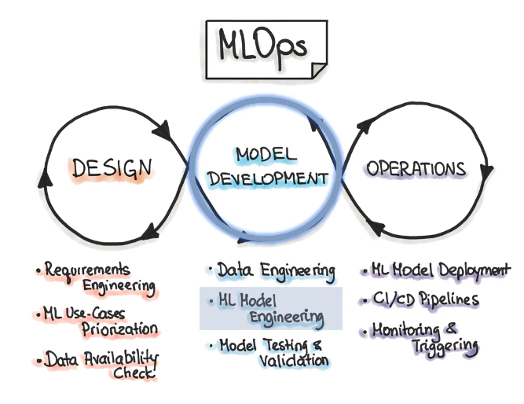

30) What AutoML does:

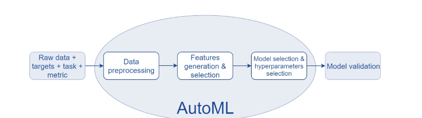

## PyCaret

31) PyCaret is an open source, low code ML library. It has been developed in Python and reduce the time needed to create a model to minutes.

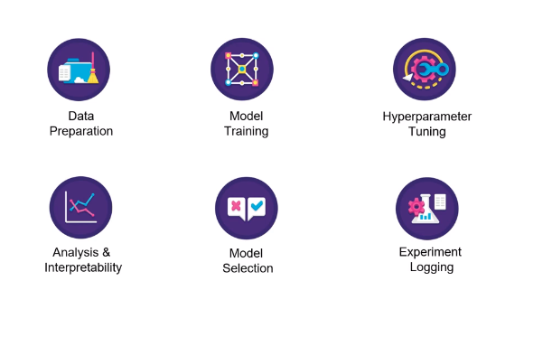

32) [PyCaret](https://pycaret.org/) incorporates these libraries:

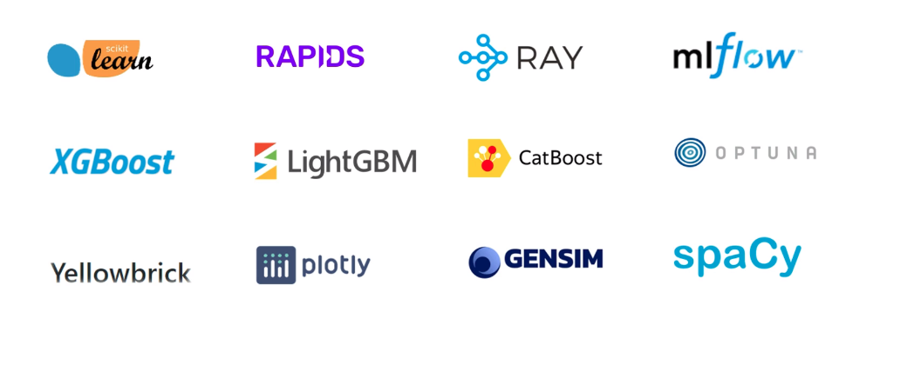

33) [Pandas Profiling](https://github.com/ydataai/pandas-profiling) is allowing us to develop an exhaustive analysis of data.

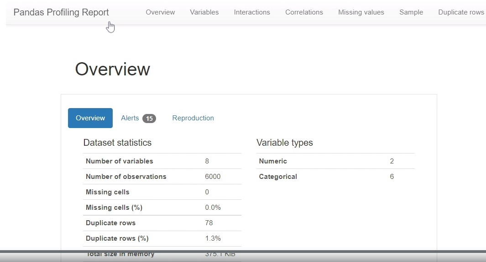

34) An example of PyCaret setup function:

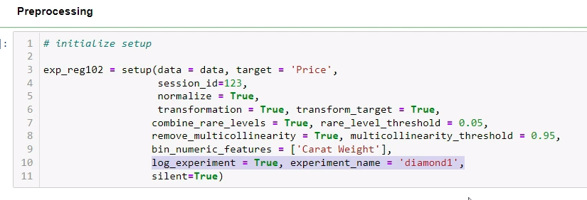

35) Tukey-Anscomble Plot && Normal QQ Plot

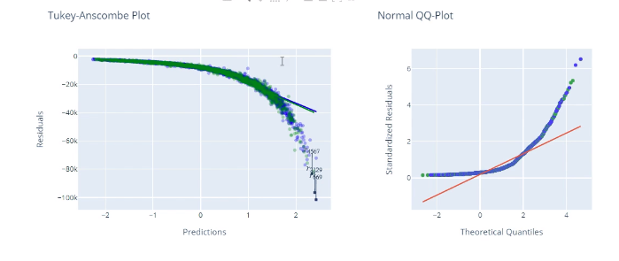

36) Scale-Location Plot && Residuals & Leverage

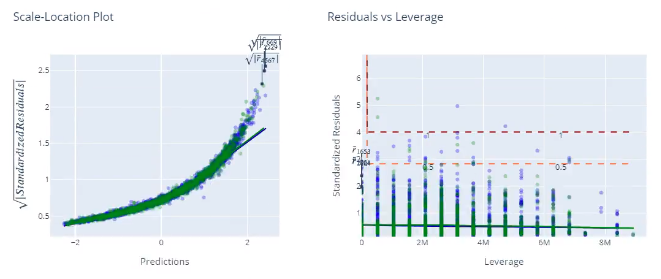

37) MLOps Tracking Server and Model Registry

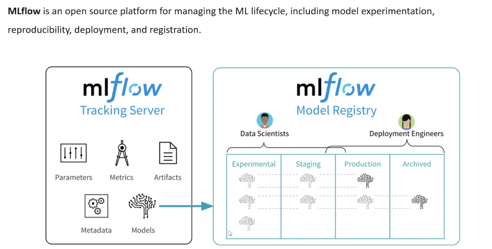

38) MLFlow UI for different runs

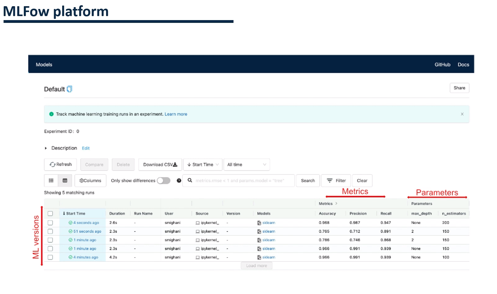

## MLFlow

39) Different Components of MLFlow

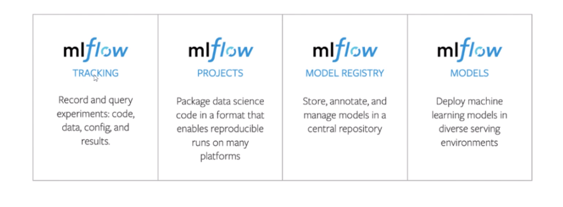

40) We can log parameters, metrics and models in [MLFlow](https://mlflow.org/).

```mlflow_demo.py

import mlflow
from sklearn.linear_model import LogisticRegression
from urllib.parse import urlparse

alpha = 0.5

def rmse_compute(true,preds):
    pass

X_train = None
y_train = None

X_test = None
y_test = None

with mlflow.start_run():

    lr = LogisticRegression(alpha = alpha)
    lr.fit(X_train,y_train)
    y_test_preds = lr.predict(X_test)
    rmse = rmse_compute(y_test,y_test_preds)
    mlflow.log_param('alpha',alpha)
    mlflow.log_metric('rmse',rmse)

    tracking_url_type_store = urlparse(mlflow.get_tracking_uri()).scheme

    if tracking_url_type_store != 'file':
        mlflow.sklearn.log_model(lr,'model',registered_monel_name = 'ElasticNetWineModel')
    else:
        mlflow.sklearn.log_model(lr,'model')


```

41) We can register models into MLFlow via PyCaret.

```
#pass log_experiment = True, experiment_name = 'diamond'

s = setup(data, target = 'Precio', transform_target = True, log_experiment = True, experiment_name = 'diamond')

```

## Shap

42) [Shap](https://shap.readthedocs.io/en/latest/index.html) is a Python library about model interpretability.

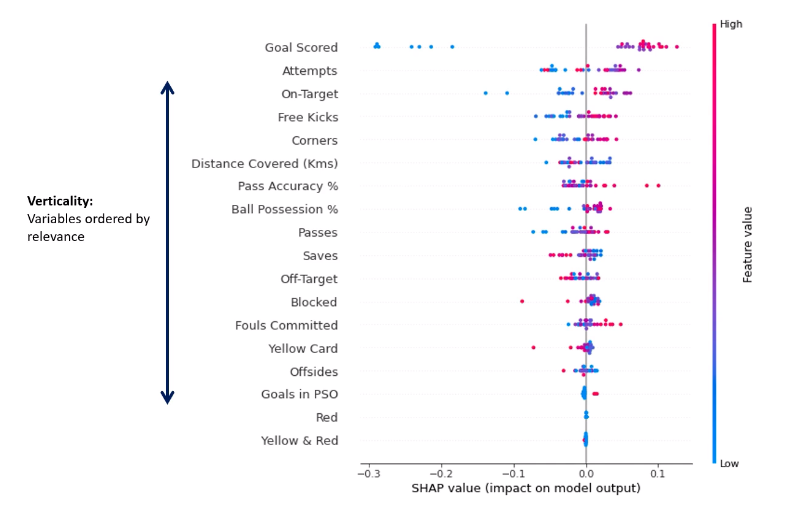

43) A prediction for a single record

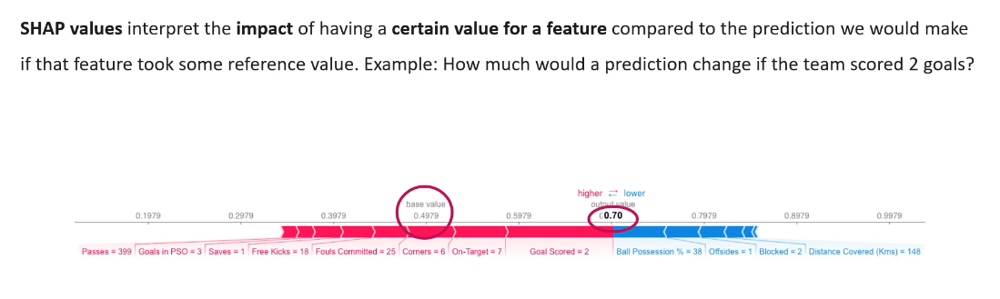

44) We can use SHAP with PyCaret.

## Deploying the model

45) We aren't just deploying a model(a pickle file). We are also deploying a pipeline(composed of preprocessing, feature engineering etc.)

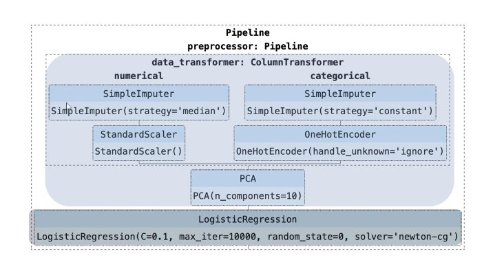

46) There are 2 different ways to deploy a model in a production environment

    - Through API
    - Through Applications(mobile/web)

## FastAPI

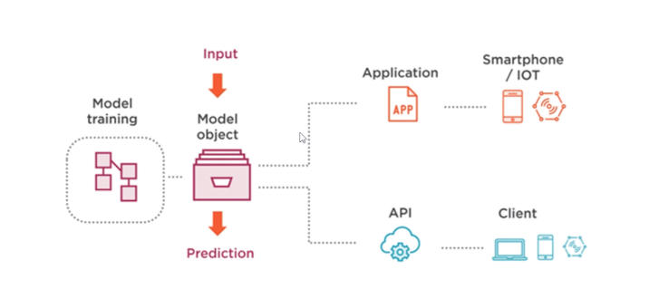

47) API is an intermediary between 2 different applications that communicate each other. If we want our applications to be available for other developers, creating an api as an intermediate connector is convenient. Developers send http request to consume this service. We can think of an API as an bstraction of our application. Thanks to API, users don't need code or install the dependencies.

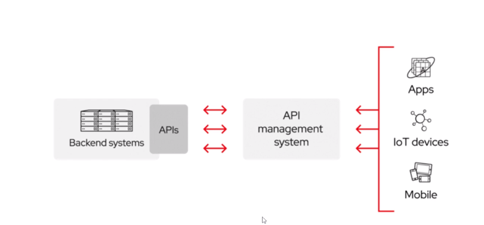

48) HTTP verbs and Status Codes

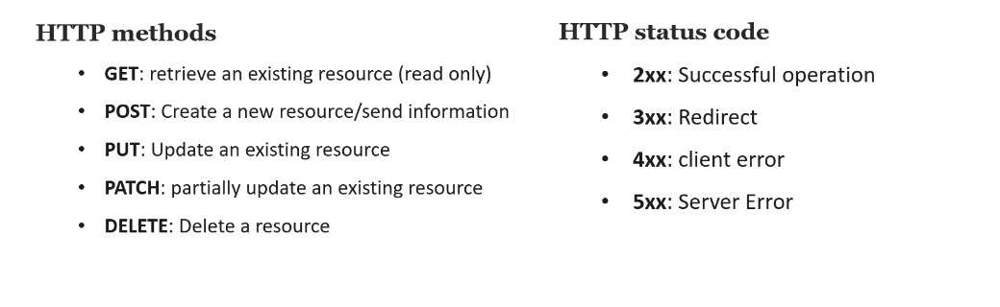

49) FastAPI is the framework creating robust & high-performance API for production environments. Compared to Flask, which is a development framework, FastAPI has the following advantages:

    - Using syncio
    - Implementing PyDantic for data validation
    - FastAPI forces the schema application and input data and detect data types at runtime.
    - FastAPI uses swagger UI to create automatic documentation.
    - FastAPI has a better security and authentication features.

50) FastAPI documentation UI

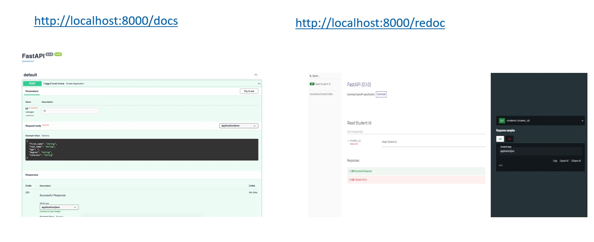

51) FastAPI is built on top of uvicorn library.

52) A basic usage of FastAPI

```
import uvicorn
from fastapi import FastAPI

app = FastAPI()
@app.get('/')
def home():
    return {'Hello': 'World'}

#@app.post("/")
#def home_post():
#    return {"Hello": "POST"}

if __name__ == '__main__':
    uvicorn.run("hellow_world_fastapi:app")

#query parameters
@app.get("/employee")
def home(department: str):
    return {"department": department}

#path parameters
@app.get("/employee/{id}")
def home(id: int):
    return {"id": id}

```

53) Pydantic usage in FastAPI

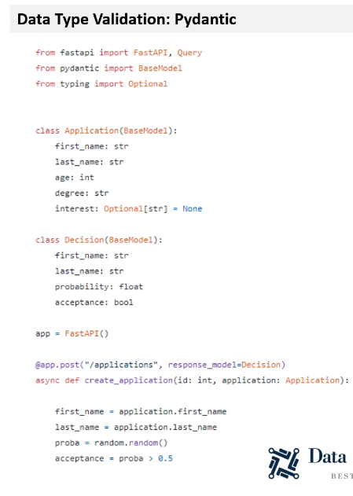

54) PyCaret is able to create automated FastAPI.

## Gradio

55) [Gradio](https://gradio.app/) is a web application to deploy our ML models. It has a UI for business users.

56) An example demo for gradio app

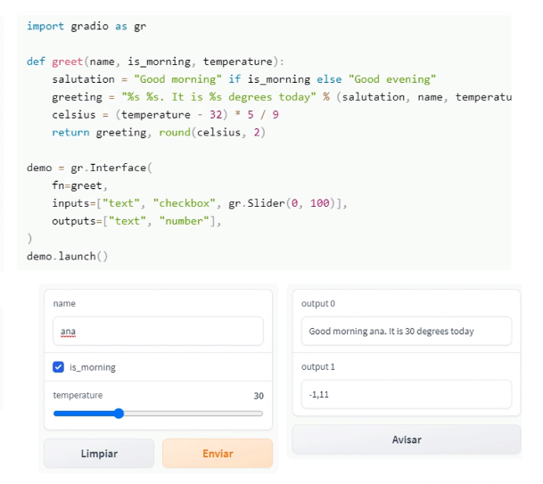

57) PyCaret has a function to create gradio apps easily.

## Flask

58) Flask is a web development framework in Python.

    - It is easy to use.
    - It is flexible.
    - Allows testing.

59) An example code snippet for Flask

```
from flask import Flask

app = Flask(__name__)

@app.route("/")
def home():
    return {"Hello": "World"}

if __name__ == '__main__':
    app.run()

```

60) A ML Project Deployment Pipeline

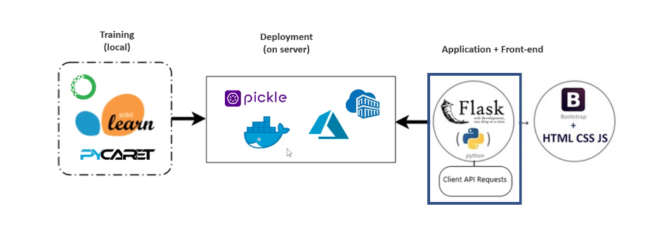

61) Dockerfile can be thought as recipy to cook a meal.

62) Phyical Machine vs Virtualization vs Container Deployment vs Kubernetes

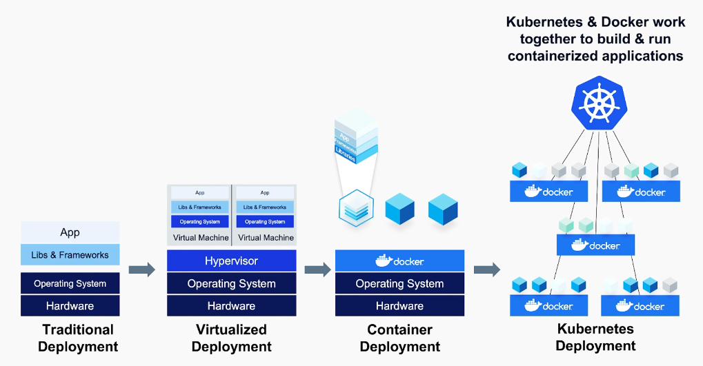

63) We can create a docker image using PyCaret vida `create_docker` function of PyCaret.

## Azure

64) If we are using a paid Azure account, we can register our Docker images on Azure Registry.

65) Azure Blob Storage is similar to Amazon S3. To use asure blob storage, azure SDK is needed.

# Practical MLOPS Notes

## Intrıduction to MLOPS

1) ML job listings are much more than data science job listings.

2) MLOps is the process of automating machine learning using DevOps methodologies.

3) Data drift is a phonomenia that means data changed from training to inference.

4) New Relic, Data Dog and Stackdriver are performance monitoring tools.

5) An example Makefile is below. Run `make install` or `make lint` or `make test`.

```Makefile
install:
	pip install --upgrade pip &&\
		pip install -r requirements.txt
lint:
	pylint --disable=R,C hello.py

test:
	python -m pytest -vv --cov=hello test_hello.py
```

6) Data Lake is a place where we can process data without transferring it outside.

7) MLOPS is possible after Devops(Jenkins), Data automation(Airflow) and platform automation(AWS Sagemaker) are completed.

8) Building reusable ML pipelines is crucial and related to versioning.

9) [Locust](https://locust.io/) and [loader.io](https://loader.io/) are 2 ways for load testing.

10) MLOPS is a combination of Data, Devops, Models and Business equally.

## MLOPS Foundations

## MLOPS for containers and Edge Devices

1) The future means more ML at the edge devices.

2) [The Coral Project](https://coral.ai/) is a platform that helps build local (on-device) inferencing that captures the essence of edge deployments: fast, close to the user, and offline.

3) Azure Percept is a Microsoft solution similar to The Coral Project.

## Continuous Delivery for Machine Learning Models

1) Github actions can be located under .github/workflows/ as main.yaml. 

2) An examle overview of CI/CD

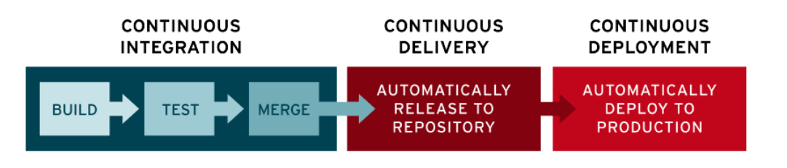

3) Kubernetes is a good way to implement Blue-Green Deployment.

4) Blue green deployment is a way for deployments. There are 2 environments. The current is blue and the new version is green. The app is running on blue environment. We are installing the new version on green environment and carrying out tests. If everything goes well, direct the traffic to green environment.

5) Canary deployment is a way for deployments. We are progressively moving traffic from old environment to new environment. If something unexpected happens in the new environment, we are rolling back to the previous environment. Thus, less traffic got affected due to mistakes. If everything goes well, the traffic directed to the new environment is progressively increased up to 100%.

## AutoML and KaizenML

1 ) KaizenML is about automating everything about the machine learning process and improving it.

2) Software for training machine learning models could turn into something like the Linux kernel, free and ubiquitous.

3) AutoML is just a technique, like continuous integration (CI); it automates trivial tasks.

4) DevOps + KaizenML = MLOps. KaizenML includes building Feature Stores, i.e., a registry of high-quality machine learning inputs and the ability to monitor data for drift and register and serve out ML models

5) Uber's [Michelangelo](https://www.uber.com/en-TR/blog/michelangelo-machine-learning-platform/) is a ML as a Service. [Databricks](https://www.databricks.com/product/feature-store) has a feature store solution too.

6) Apple has a machine learning framework called Core ML. It is under Xcode > Open Developer Tool > Create ML.

7) [TFHUB](https://tfhub.dev/) is a hub to store various pretrained ML models.

8) SageMaker Autopilot is AWS's complete solution for AutoML and MLOps.

9) [Ludwig] is a Python library that builds up ML solutions declaratively. We are defining a yaml file and then running ludwig's API via programatically or CLI. It is a part of Linux foundation.

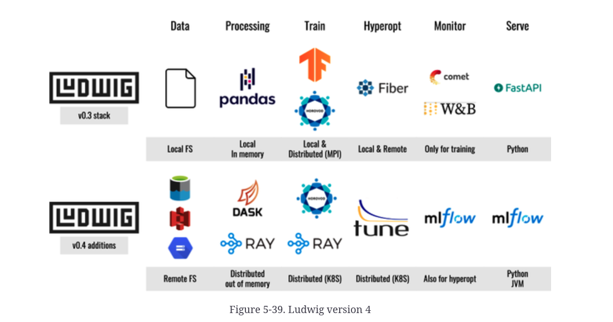

10) [FlaML](https://github.com/microsoft/FLAML) is an AutoML solution. It has a design that accounts for cost-effective hyperparameter optimization.

11) [Tpot](https://github.com/EpistasisLab/tpot) is an AutoML solution. TPOT is a Python Automated Machine Learning tool that optimizes machine learning pipelines using genetic programming.

12) [PyCaret](https://github.com/pycaret/pycaret) is an AutoML tool.

13) [Autosklearn](https://github.com/automl/auto-sklearn) is an AutoML tool.

14) [H2O AutoML](https://docs.h2o.ai/h2o/latest-stable/h2o-docs/index.html) is an AutoML tool.

15) ELI5 and SHAP are 2 popular open source Model Explainability frameworks.

## AWS for MLOPS

1) [Go Hugo](https://github.com/gohugoio/hugo) is a website to build up static websites.

2) AWS DeepLens is a hardware sol

3) It would bea good practice to have a cli.py to get predictions.

4) Github actions is an alternative to bitbucket pipelines and jenkins. Its cloud native alternative on AWS is AWS Codebuild.

5) Github container registry is an alternative to Amazon ECR(Elastic COntainer Registry).

## Machine Learning Interoperability

1) ONNX is a tool for ML Interoperability. It is a product of collaboration of Facebook and Microsoft.

2) Some libraries are able to being converted to ONNX format:

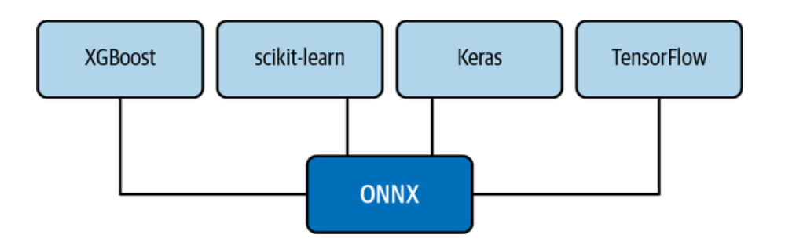

3) An example script to convert a pytorch model to ONNX format

```python
import torch
import torchvision

dummy_tensor = torch.randn(8, 3, 200, 200)
model = torchvision.models.resnet18(pretrained=True)

input_names = [ "input_%d" % i for i in range(12) ]
output_names = [ "output_1" ]

torch.onnx.export(
    model,
    dummy_tensor,
    "resnet18.onnx",
    input_names=input_names,
    output_names=output_names,
    opset_version=7,
    verbose=True,
)
```

4) ONNX has a special format callet ORT for minimized build size of the model.

## Building MLOps Command Line Tools and Microservices

1) requirements.txt file and setup.py files are able to install dependencies for a Python project. However, only setup.py file can package a project for distribution.

2) Command Line Tool Development can be useful in a situation that needs solving.

## ML Engineering and ML Use cases

1) Porting a Python model into a production language like C++ or Java is challenging, and often results in reduced performance of the original, trained model

2) [Fairlearn](https://github.com/fairlearn/fairlearn) is a python package to mitigate observed unfairness. It is a library to detect bias among gender, race, religion etc.

3) [InterpretML](https://github.com/interpretml/interpret) is a python package for ML interpretability.


