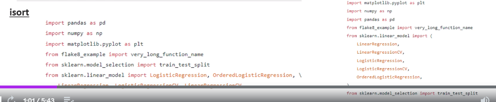
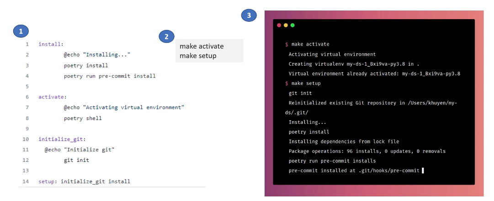

# My-MLOps-Notes
Listing my MLOps learnings

This repository is containing my notes from [this Udemy course](https://www.udemy.com/course/complete-mlops-bootcamp-from-zero-to-hero-in-python-2022/).

1) 85 percent of trained ML model don't reach production and 55 % of companies don't deploy a single model.

2) An ideal ML life cycle


3) Researches show that companies using UI increased their profit margin by 3% to 15%.

4) DevOps applied to Machine Learning is known as MLOps. Model creation must be scalable, collaborative and reproducible. The principles, tools and techniques that make models scalable, collaborative and reproducible are known as MLOps.

5) MLOps process:


6) DevOps applied to Machine Learning is known as MLOps. DevOps applied to Data is known as DataOps.

7) Roles in MLOps


8) Challenges addressed by MLOps

- Data and Artifact versioning

- Model Tracking: Degradition of performance due to data drift.

- Feature Generation: MLOPS allows to reuse methods

9) Parts of MLOPS


10) MLOps Tools


11) Some data labelling tools:

- [v7labs](https://www.v7labs.com/pricing)

- [labelbox](https://labelbox.com/pricing/)

12) Some Feature Engineering Tools:

- [feast](https://github.com/feast-dev/feast)

- [featuretools](https://github.com/alteryx/featuretools)

- [tsfresh](https://github.com/blue-yonder/tsfresh)

13) Some Hyperparameter Optimization Tools:

- [Optuna](https://optuna.org/)

- [Ray Tune](https://docs.ray.io/en/latest/tune/index.html)

14) Fast API can be used in serving ML model.

15) Streamlit is useful for POC.

16) MLOps stages:


17) Some tools to use


18) Structuring ML projects in one of 3 ways.


## Cookiecutter

19) Cookiecutter is a tool to structure our ML projects and folders.

```runall.sh
pip install cookiecutter

cookiecutter https://github.com/khuyentran1401/data-science-template
```


## Poetry

20) [Poetry](https://python-poetry.org/) allows us to manage dependencies and versions. Poetry is an alternative to pip.

    - Poetry separates main dependencies and sub dependencies into two separate files. Whereas,pip stores all dependencies in a single file(requirements.txt).
    - Poetry creates readable dependency files.
    - Poetry removes all sub dependencies when removing a library
    - Poetry avoids installing new libraries in conflict with existing libraries.
    - Poetry packages project with few lines of code.
    - All the dependencies of he project are specified in pyproject.toml

```poetry.sh
# TO install poetry on your machine(for linux and mac)
curl -sSL https://install.python-poetry.org | python3 -


# To generate a project
poetry new <project_name>

# To install dependencies
poetry install

# To add a new pypi library
poetry add <library_name>

# To delete a library
poetry remove <library_name>

# To show installed libraries
poetry show

# To show sub dependencies
poetry show --tree

# Link our existing environment(venv, conda etc) to poetry
poetry env use /path/to/python
```

21) [Hydra](https://hydra.cc/docs/intro/) manages configuration files. It makes project management easier.

    - Configuration information shouldn't be mixed with main code.
    - It is easier to modify things in a configuration file.
    - YAML is a common language for a configuration file.
    - An example config file and its usage via hydra
    - We can modify hydra parameters via CLI without modifying config file.

    

    

    - Hydro logging is super useful.

    - To use hydra, we must add config as an argument to a function.

```
import hydra
from pipeline2 import pipeline2

@hydra.main(config_name = 'preprocessing')
def run_training(config):

    match_pipe = pipeline2(config)


```


22) [Pre-commit](https://pre-commit.com/) plugins: It automates code review and formatting. In order to install them, use `pip install pre-commit`. After installing `pre-commit`, fill out `.pre-commit-config.yaml` and run `pre-commit install` to install it. Then, some checks are run before committing to local repository. Commit will not be done until the problem got solved. `--no-verify` is flag that can be appended to git commit. It doesn'T force you to correct the mistakes detected by pre-commit.


    - Formatter: black
    - PEP8 Checker: flake8
    - Sort imports: isort
    - Check for docstrings: interrogate


23) Black and Flake8

```run.sh
# pip install black
black file_name_01.py

# pip install flake8
flake8 temp.py
```

24) isort and iterrogate

    - correct isort:
    

```isort_usage.py
#pip install isort
isort file_name.py
#pip install interrogate
interrogate -vv file_name.py

```

25) [DVC](https://dvc.org/) is used for version control of model training data.

26) [pdoc](https://github.com/mitmproxy/pdoc) is used to automatically create documentation for projects.

```install.sh
pip install pdoc3

pdoc --http localhost:8080 temp.py

```

27) Makefile creates short and readable commands for configuration tasks. We can use Makefile to automate tasks such as setting up the environment.




